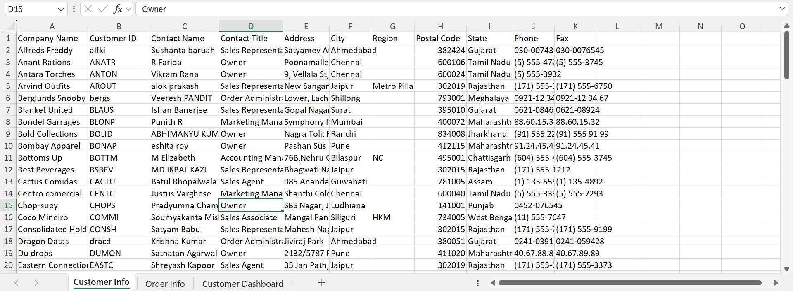
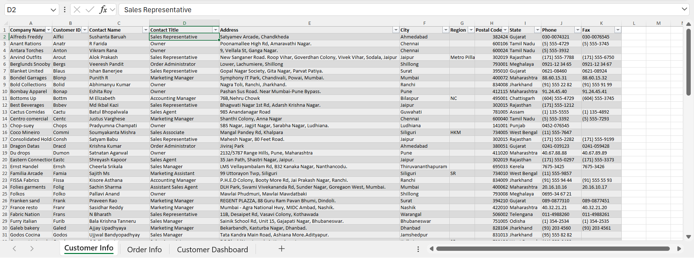
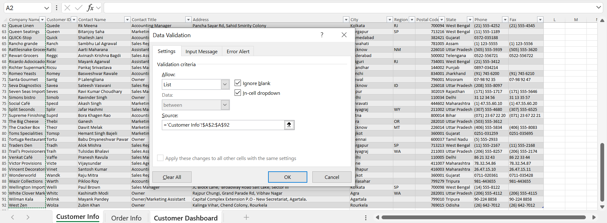
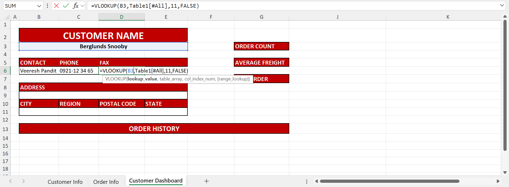
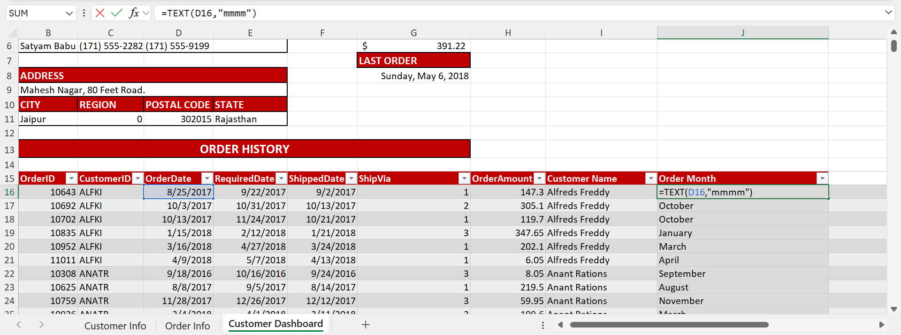
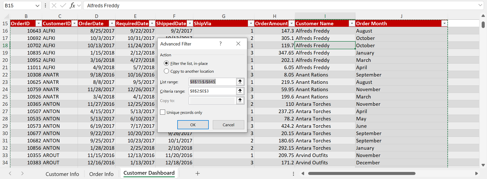
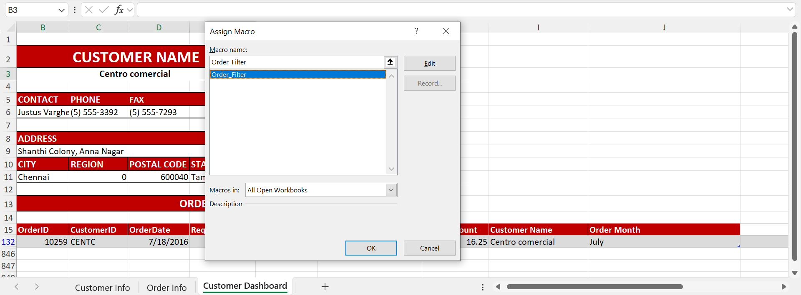

# CREATING-A-FUNCTIONAL-AND-ENGAGING-CUSTOMER-DASHBOARD
## OVERVIEW 
To avoid digging through multiple spreadsheets of data, Dashboards are created to centralize key metrics and provide real-time updates. They are essential tools for summarizing data and providing a visual way to share data reports with stakeholders.   

This repository showcases the development of an interactive Customer Dashboard using Microsoft Excel. The dashboard centralizes key customer and order data, enabling stakeholders to efficiently access, filter, and analyze information across over 800 orders and 90+ customers. By combining Excel functions, data validation, advanced filtering, and VBA automation, the solution simplifies data retrieval, enhances decision-making, and minimizes manual effort.

  


[Here](https://1drv.ms/v/c/db86765fede75dbf/EQL47iJK_7ZPi0Od77bVXT8BNC6-YmGHXVDFWqpCeushkw) is a quick walkthrough of the dashboard in action:
https://1drv.ms/v/c/db86765fede75dbf/EQL47iJK_7ZPi0Od77bVXT8BNC6-YmGHXVDFWqpCeushkw
## BUSINESS VALUE OF THE DASHBOARD 
This interactive Customer Dashboard helps stakeholders:  

* Quickly **retrieve key customer information** without navigating multiple spreadsheets  
* Instantly **analyze order history** and performance metrics (e.g., order count, average freight, last order date)  
* **Improve decision-making** around sales engagement, shipping trends, and customer relationship management  
* **Save time** by eliminating repetitive filtering tasks through macro automation  

This Dashboard transforms customer and order data into a single, intuitive interface, and enables **efficient reporting, better customer tracking**, and **faster insights**, especially useful for sales teams, operations, or customer support departments
## DATASET OVERVIEW 
The raw Excel file contains 2 worksheets: Customer Info and Order Info.  

**Customer Info** contains Customer details across:  
**11** columns (Company Name, Customer ID, Contact Name, Contact Title, Address, City, Region, Postal Code, State, Phone and Fax) and **92** rows(individual customers)  

**Order Info** contains Customer Orders details across:  
**11** columns (Order Id, Customer Id, Order Date, Required Date, Shipped Date, Shipped Via, Order Amount, Ship Name, Ship Address, Ship City, Ship Region, Ship Postal and Ship State) and **831** rows.

## STEPS TAKEN IN CREATING THE CUSTOMER REPORT PAGE 
**1.	Data Loading and Understanding**
   * Loaded the raw data into Excel 
   * Examined columns needed for summarization 
   * Identified Blanks, Inconsistencies and Errors



**2.	Data Cleaning**
 * Structured the data: this involved processes such as auto-fit column width and converting the spreadsheet into an Excel table. Better sorting, filtering and automation are some of the results of these processes
 * Text Formatting: Excel functions such as PROPER, UPPER were used to standardize texts 
 * Handling of Blank Cells: Blank Cells were identified in 2 Columns, Region and Fax. They were left blank due to being personal information of Customers omitted, to ensure data integrity.


**3. Dashboard Design:**  
The dashboard was designed to show both Customer and Order Information Segments simultaneously
* Data Validation: Created a drop-down list for selecting Customer names

 

* Excel Lookup Function: Customer details were auto filled using **VLOOKUP** and **XLOOKUP** functions based on the Customer name selected in the drop-down list



* Order Summary Preparation: Order History data was copied from the Order Info sheet into the Dashboard sheet and formatted to show necessary columns. New Column ‘Month’ was created and populated using Excel formula **TEXT**.  Column name ‘Shipped Name’ was also edited into ‘Customer Name’ in preparation for Advanced Filtering. This creates a connection between the Order History table and the Customer Name to be filtered. 



* Auto-filling the Order Information Segment: Excel function **SUBTOTALS** was used to populate order summary of corresponding Customers. Order summaries include Order Count, Average freight and last order date.  

To auto populate the order summary mentioned above from the Order History table, **Advanced Filtering** was applied




**4.	Automation with Macros:** 
To prevent the repetitive task of manually applying an Advanced Filter each time a customer is selected, an **Excel Macro ‘Order_Filter’** was recorded and customized in VBA (Visual Basic for Applications). The Macro is designed to automatically:
* Capture the customer name selected from the drop-down
* Apply an advanced filter to the Order History Table 
* Display only the records that match the selected customer  





The macro is triggered using a **form control button** on the dashboard, allowing users to quickly refresh the filtered results with a single click.
Here is the VBA code employed: 
```  
Sub Order_Filter()  
  'Applies an advanced filter to show orders for the selected customer
  Range('OrderHistory[#All]).AdvancedFilter Action:=xlFilterInPlace,_  
    CriteriaRange:=Range("B2:B3"),Unique:=False  
End Sub  
  
``` 
## CUSTOMER AND ORDERS DASHBOARD RESULT 
The customer and orders dashboard is an interactive summary page that: 
* Provides a drop-down list of Customer names 
* Automatically displays customer information based on the selected customer name
* Generates order summary calculations of selected customer, and;
* Presents an overview of the selected customer's past orders.  

This Dashboard handles **91** Customer Entries and summarizes over **800** orders in real-time. It displays essential order metrics such as average freight costs, purchase frequency, and most recent order dates, helping teams make quicker, more informed sales and support decisions.  
It is designed with drop-downs and buttons to allow non-technical users to interact with customer data without needing to filter or write formulas.  
It reduces the risk of errors and inconsistencies by automating repetitive data filtering.
## KEY TOOLS APPLIED
Excel Table  
Excel Functions like PROPER, TEXT, VLOOKUP, XLOOKUP and SUBTOTAL  
Data Validation  
Advanced Filtering  
Macros (VBA)
## CONCLUSION 
This project demonstrates how Excel’s built-in tools, combined with basic automation, can deliver powerful reporting solutions. It highlights the value of clean data, user-centered design, and efficiency in everyday business analysis. 

